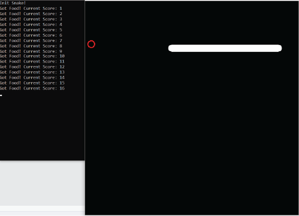

# OpenCV-Snake

 
 OpenCV-Snake is a simple game of Snake implemented using OpenCV.
 
# Gameplay
To play Snake, you will have to build and run this project on your own.
Once that is complete, you can run the program and use W, A, S, and D to move your snake.
Have fun!

 ## Dependencies
 You will need to install the following before using this program.

 OpenCV 4.2.0

 I used vcpkg to install OpenCV. You can too: [https://docs.microsoft.com/en-us/cpp/build/vcpkg?view=vs-2019](https://docs.microsoft.com/en-us/cpp/build/vcpkg?view=vs-2019)
